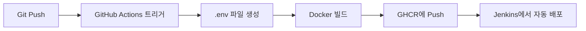

# GitHub Actions 자동 배포 설정 가이드

## 🔐 GitHub Secrets 설정

GitHub Actions에서 Liveblocks API 키를 사용하려면 Repository Secrets에 등록해야 합니다.

### 1단계: Liveblocks API 키 발급

1. [Liveblocks Dashboard](https://liveblocks.io/dashboard) 접속
2. 프로젝트 선택 또는 새로 생성
3. **API Keys** 메뉴로 이동
4. **Public Key** 복사 (형식: `pk_dev_...` 또는 `pk_prod_...`)

### 2단계: GitHub Secrets 등록

1. GitHub 저장소 페이지로 이동
2. **Settings** → **Secrets and variables** → **Actions** 클릭
3. **New repository secret** 버튼 클릭
4. Secret 추가:
   - **Name**: `VITE_LIVEBLOCKS_PUBLIC_KEY`
   - **Value**: 복사한 Liveblocks Public Key (예: `pk_dev_xxxxxxxxxxxxx`)
5. **Add secret** 클릭


## 🚀 자동 배포 워크플로우

### 작동 방식



### 워크플로우 파일: `.github/workflows/docker-build.yml`

```yaml
- name: Create .env file
  run: |
    echo "VITE_LIVEBLOCKS_PUBLIC_KEY=${{ secrets.VITE_LIVEBLOCKS_PUBLIC_KEY }}" > .env
    echo "✅ .env file created with Liveblocks API key"
```

이 단계에서:
1. GitHub Secrets에서 `VITE_LIVEBLOCKS_PUBLIC_KEY` 값을 가져옴
2. `.env` 파일 생성
3. Docker 빌드 시 이 파일이 포함됨
4. Vite 빌드 단계에서 환경 변수를 읽어 번들에 포함

### 트리거 조건

다음 경우에 자동으로 빌드 및 배포가 실행됩니다:

- ✅ `main`, `master`, `develop` 브랜치에 push
- ✅ `v*` 형식의 태그 push (예: v1.0.0)
- ✅ `main`, `master` 브랜치로의 Pull Request

## 🔍 빌드 확인

### Actions 탭에서 확인

1. GitHub 저장소의 **Actions** 탭 클릭
2. 최근 워크플로우 실행 확인
3. "Create .env file" 단계에서 ✅ 표시 확인
4. 빌드 성공 시 Docker 이미지가 GHCR에 Push됨

### 로그 확인 예시

```
Run echo "VITE_LIVEBLOCKS_PUBLIC_KEY=$***" > .env
✅ .env file created with Liveblocks API key
```

> **보안 참고**: GitHub Actions는 Secret 값을 자동으로 마스킹하여 `***`로 표시합니다.

## 🐳 생성된 Docker 이미지

### 이미지 위치

```
ghcr.io/<username>/<repository>:latest
ghcr.io/<username>/<repository>:main
ghcr.io/<username>/<repository>:develop
ghcr.io/<username>/<repository>:v1.0.0
```

### 멀티 아키텍처 지원

- ✅ `linux/amd64` (Intel/AMD 서버)
- ✅ `linux/arm64` (ARM 서버, Apple Silicon)

## 🔧 문제 해결

### Secret이 설정되지 않은 경우

**증상**: 빌드는 성공하지만 앱 실행 시 Liveblocks 연결 실패

**해결**:
1. GitHub Secrets에 `VITE_LIVEBLOCKS_PUBLIC_KEY`가 정확히 등록되었는지 확인
2. Secret 이름 철자 확인 (대소문자 구분)
3. Liveblocks API 키가 유효한지 확인 (Dashboard에서 확인)

### .env 파일이 빌드에 포함되지 않는 경우

**증상**: Actions 로그에서 "Create .env file" 단계는 성공하지만 빌드된 앱이 작동하지 않음

**해결**:
1. Dockerfile의 `COPY . .` 명령어가 있는지 확인
2. `.dockerignore` 파일에 `.env`가 포함되어 있지 않은지 확인

### 로컬 개발 환경과 다른 경우

**로컬 개발**:
- `.env` 파일을 수동으로 생성
- `npm run dev` 실행

**CI/CD (GitHub Actions)**:
- GitHub Secrets에서 자동으로 `.env` 생성
- Docker 빌드 시 자동 포함

## 📝 체크리스트

배포 전 확인사항:

- [ ] Liveblocks 계정 생성 및 프로젝트 생성 완료
- [ ] Liveblocks Public Key 발급 완료
- [ ] GitHub Repository Secrets에 `VITE_LIVEBLOCKS_PUBLIC_KEY` 등록 완료
- [ ] `.github/workflows/docker-build.yml` 파일에 ".env 생성" 단계 포함
- [ ] 로컬에서 테스트 완료 (`.env` 파일로)
- [ ] Git push 후 Actions 탭에서 빌드 성공 확인

## 🎯 다음 단계

1. **코드 수정 및 Push**
   ```bash
   git add .
   git commit -m "feat: Migrate from WebRTC to Liveblocks"
   git push origin main
   ```

2. **GitHub Actions 확인**
   - Actions 탭에서 워크플로우 실행 확인
   - 모든 단계 성공 확인

3. **Jenkins 자동 배포**
   - Jenkins가 설정되어 있다면 자동으로 새 이미지를 pull하여 배포
   - 없다면 수동으로 이미지 pull 및 실행

4. **배포 확인**
   ```bash
   # 이미지 pull
   docker pull ghcr.io/<username>/<repository>:latest
   
   # 컨테이너 실행
   docker run -d \
     --name sure-hackathon-app \
     -p 3000:3000 \
     -v $(pwd)/data:/app/data \
     -v $(pwd)/workspace:/app/workspace \
     ghcr.io/<username>/<repository>:latest
   ```

## 🔗 참고 링크

- [GitHub Actions Secrets 문서](https://docs.github.com/en/actions/security-guides/encrypted-secrets)
- [Liveblocks Dashboard](https://liveblocks.io/dashboard)
- [GHCR 사용 가이드](https://docs.github.com/en/packages/working-with-a-github-packages-registry/working-with-the-container-registry)

---

**문제가 있나요?** Issues 탭에 등록하거나 팀원에게 문의하세요.

